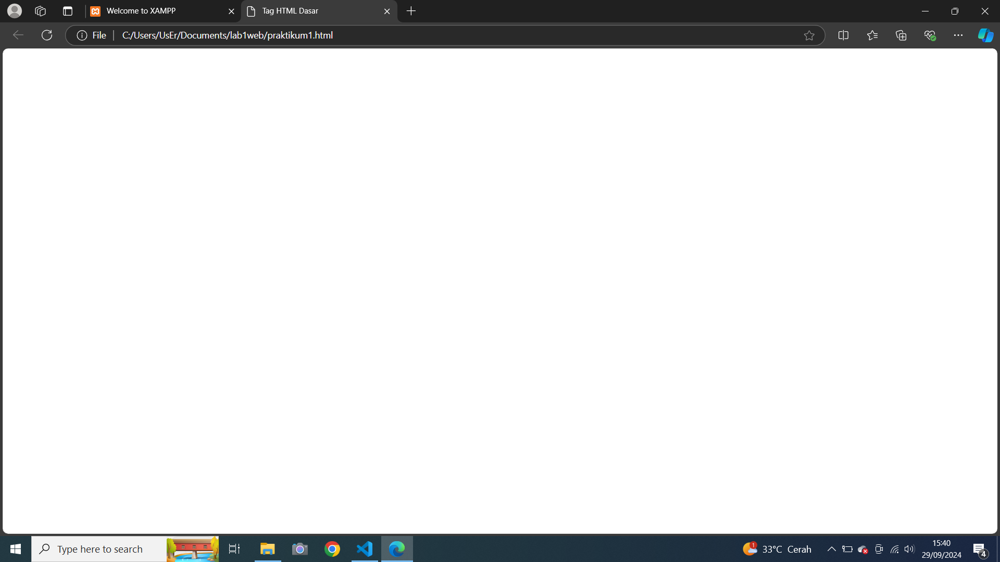
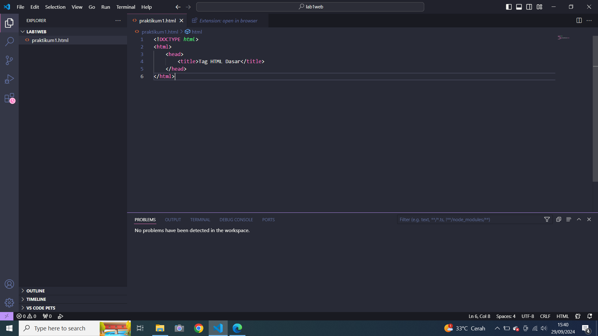

# Lab1web
## Nama  : Muhamad Ananda Putra Fraceda
## NIM   : 312310440
## Kelas : TI.23.A4
## 1. Menambahkan file baru praktikum1 dan menambahkan tag dasar dokumen HTML.
- Gambar1
  
- Gambar2
  
# 2. Kemudian membuat beberapa paragraf sederhana
- Gambar result
# 3. Kemudian atur atribut paragraf dan menambahkan sub judul
- Gambar1
- Gambar result
# 4. Format teks pada paragraf tersebut
- Gambar result
# 5. Kemudian menyisipkan gambar kepada halaman web dan menambahkan judul
- Gambar1
- Gambar2
- Gambar result 1&2
# 6. Menambahkan Hyperlink pada dokumen tersebut
- Gambar1
- Final result
